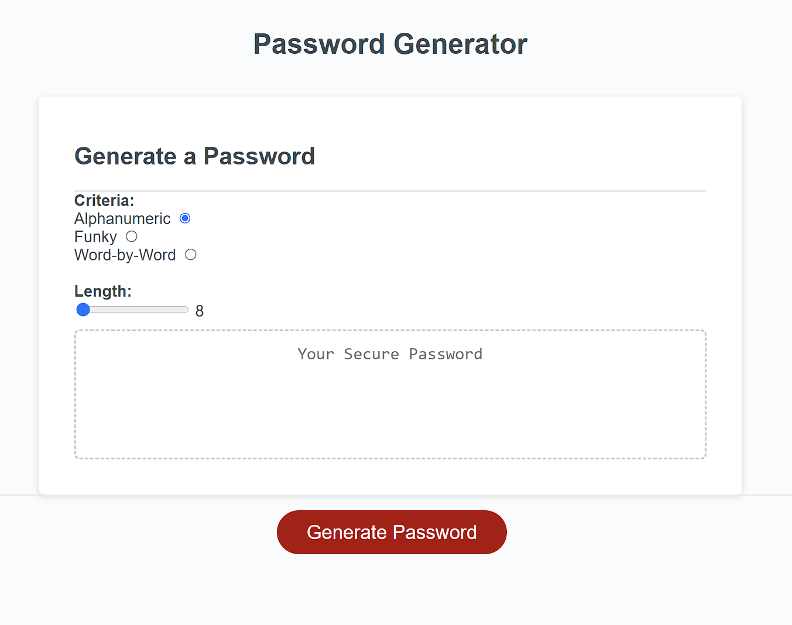

# Password Generator

## Table of Contents

1. [Introduction](#introduction)
2. [Developer Comments](#developer-comments)
3. [Update Log](#update-log)
4. [Deployed Application](#deployed-application)
5. [References](#references)
6. [Creators](#creators)
7. [License](#license)

## Introduction

This is the Week 3 challenge of the edX/Monash Bootcamp.  The application is a password generator.  You choose alphanumeric, funky (includes special characters) or word-by-word criteria options, and a password length between 8-128 for alphanumeric and funky or 2-20 for word-by-word.

## Developer Comments

In this challenge, I learned more about array and string handling.  I would like to know if there is more efficient ways to write my code, and I'll be querying it in next class.  Next time I think the first thing I'll do is read the acceptance criteria because afterwards I read that I was meant to separate the password criteria by Uppercase, Lowercase and Numeric, which I would have needed to use checkboxes instead of radio buttons; initially I thought there was more flexibility, based on what was told in class, but after I did the challenge I read the acceptance criteria.  The acceptance criteria also states to use prompts but I believe in class, it was stated that there was extra points for not using prompts; hence why I made a form.

## Update Log

### 11/06/2023
- Added password history feature.

## Deployed Application

<https://x4ndez.github.io/passwordgen/>

## References

Word list obtained from: www.bestwordlist.com.

## Creators

**Xande** : <https://github.com/x4ndez>

## License

Code released under the MIT License.